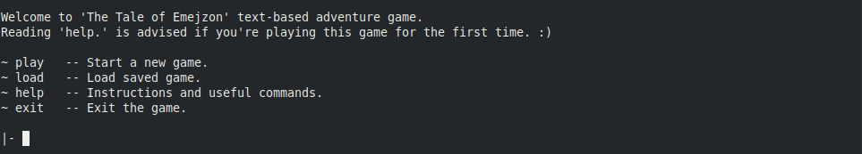
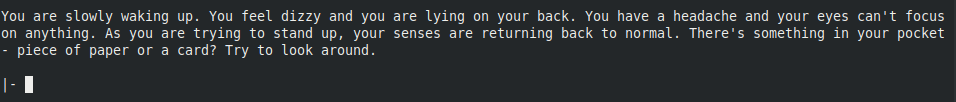
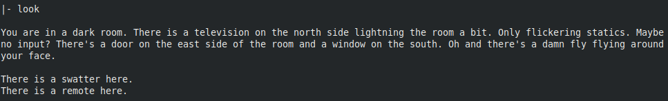
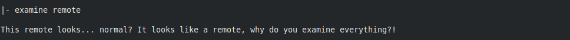
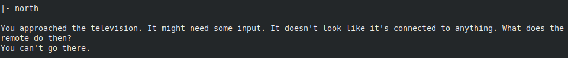
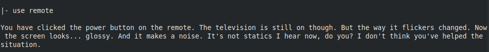

# TheTaleOfEmejzon

## About the game (Spoiler-free)
Text-based adventure game created in Prolog Logical programming language.
* It's hard
* Insane Puzzles
* Funny references
* Unexpected realism
* Maybe it's more than a game
* (It's going to be the first 3D text-based game, where the third dimension is outside your terminal window.)

## Features

#### Game mechanics:
* Map and movement between locations
* Items and inventory management
* Usable items
* Crafting (combining items)
* Health, taking damage and healing
* Enemies and combat (kind of...)

#### Other features:
* Python interface for better user experience
* Save/Load game

## Requirements
* Python (3.4 or higher)
* SWI-Prolog
* [PySwip](https://github.com/yuce/pyswip "PySwip by Yuce Tekol")

## Play the game
1. If you do not have Python, install it! (you'll also need pip)
2. Install SWI-Prolog:  
`sudo apt install swi-prolog`
3. Install PySwip:  
Follow this [installation guide](https://github.com/yuce/pyswip/blob/master/INSTALL.md "PySwip INSTALL")
4. Run the game (from game folder):  
`python game.py` or `python3 game.py`

## TODO

#### TODO list:
* Continue with the story
* Expand map
* Privatize some instruction (some shouldn't be available to users)

#### Future TODO list:
* Instruction autocomplete
* Wrong instruction suggestion

#### Blue-sky TODO list:
* Python Console GUI
* From TEXT to 2D graphics
